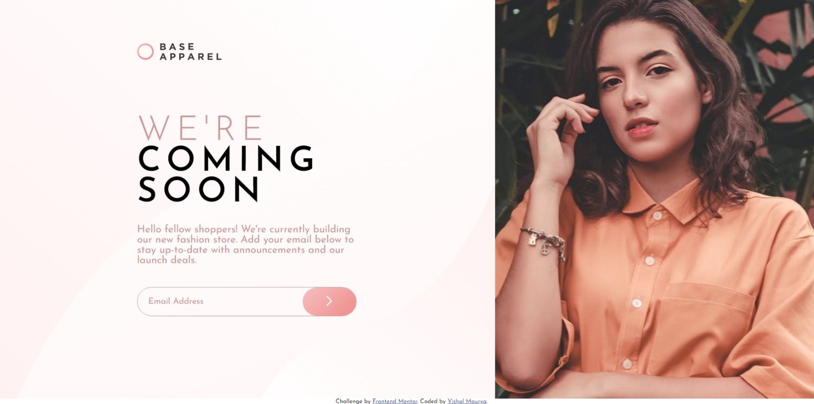

# Frontend Mentor - Base Apparel coming soon page solution

This is a solution to the [Base Apparel coming soon page challenge on Frontend Mentor](https://www.frontendmentor.io/challenges/base-apparel-coming-soon-page-5d46b47f8db8a7063f9331a0).

## Table of contents

- [Frontend Mentor - Base Apparel coming soon page solution](#frontend-mentor---base-apparel-coming-soon-page-solution)
  - [Table of contents](#table-of-contents)
  - [Overview](#overview)
    - [The challenge](#the-challenge)
    - [Screenshot](#screenshot)
    - [Links](#links)
  - [My process](#my-process)
    - [Built with](#built-with)
    - [What I learned](#what-i-learned)
  - [Author](#author)


## Overview

### The challenge

Users should be able to:

- View the optimal layout for the site depending on their device's screen size
- See hover states for all interactive elements on the page
- Receive an error message when the `form` is submitted if:
  - The `input` field is empty
  - The email address is not formatted correctly

### Screenshot




### Links

- Solution URL: [Click Here](https://www.github.com/VishalMauryastp/base-apparel-coming-soon-master)
- Live Site URL: [Click Here](https://vishalmauryastp.github.io/base-apparel-coming-soon-master/)


## My process

### Built with

- Semantic HTML5 markup
- CSS custom properties
- Flexbox
- Mobile-first workflow
- jQuery
- scss/sass  


### What I learned

In this project I learned how to do validation by using jQuery.

```js
$(document).ready(function () {
  $("#sub_btn").click(function (e) {
    var email = $("#Email").val();
    console.log("valid");

    if (email != 0) {
      if (isValidEmailAddress(email)) {
        $(".input_btn").css({
          border: "2px solid hsl(0, 36%, 70%)",
        });
        $(".icon-error").css({
          display: "none",
        });
        $(".error").css({
          display: "block",
        });
        $(".error").css({
          color: "green",
        });
        $("#Email").val("");
        $(".error").text("Email successfully Submitted");
        setTimeout(() => {
          $(".error").text("");
        }, 2000);
      } else {
        $(".input_btn").css({
          border: "2px solid red",
        });
        $(".icon-error").css({
          display: "block",
        });
        $(".error").css({
          display: "block",
        });
        $(".error").css({
          color: "red",
        });
        $(".error").text("please provide a valid email");
      }
    } else {
      $(".input_btn").css({
        border: "2px solid red",
      });
      $(".error").css({
        display: "block",
      });
      $(".error").css({
        color: "red",
      });
      $(".icon-error").css({
        display: "block",
      });
      console.log("valid3");
    }
  });
});

function isValidEmailAddress(email) {
  var pattern = new RegExp(
    /^(("[\w-\s]+")|([\w-]+(?:\.[\w-]+)*)|("[\w-\s]+")([\w-]+(?:\.[\w-]+)*))(@((?:[\w-]+\.)*\w[\w-]{0,66})\.([a-z]{2,6}(?:\.[a-z]{2})?)$)|(@\[?((25[0-5]\.|2[0-4][0-9]\.|1[0-9]{2}\.|[0-9]{1,2}\.))((25[0-5]|2[0-4][0-9]|1[0-9]{2}|[0-9]{1,2})\.){2}(25[0-5]|2[0-4][0-9]|1[0-9]{2}|[0-9]{1,2})\]?$)/i
  );
  return pattern.test(email);
}

```


## Author

- Github - [@VishalMauryastp](https://www.github.com/VishalMauryastp)
- Frontend Mentor - [@VishalMauryastp](https://www.frontendmentor.io/profile/VishalMauryastp)
- LinkedIn - [@Vishal Maurya](https://www.twitter.com/yourusername)
